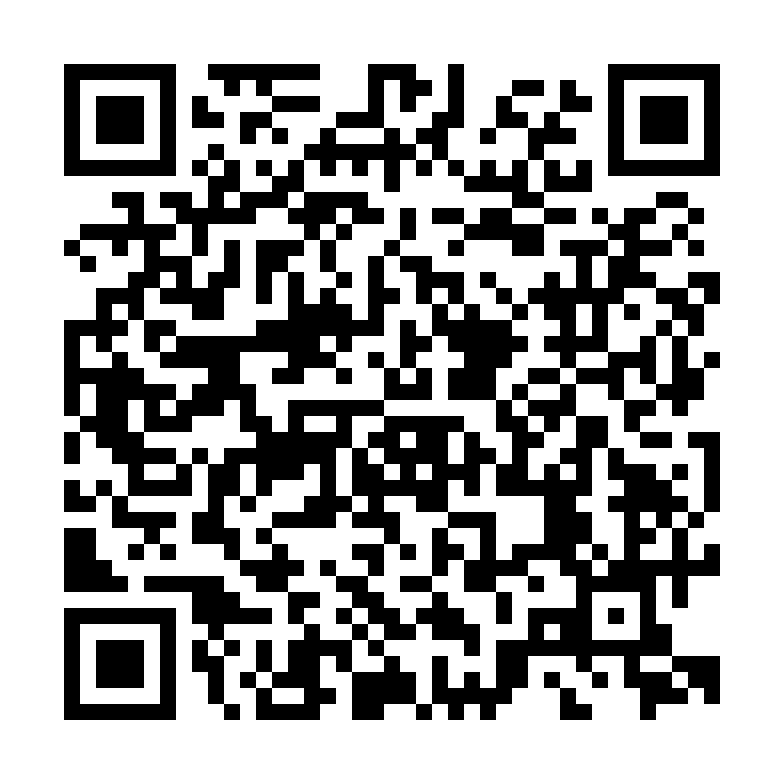

# Dennis Kalinin — Cybersecurity Portfolio

Cybersecurity professional developing hands-on experience across enterprise security, networking, system hardening, threat analysis, infrastructure, PKI/TLS, IAM, and security operations.

**M.S. Cybersecurity Investigations & Intelligence**
**B.S. Cybersecurity & Digital Forensics**

---

## Featured Work

### Scattered Spider Threat Intelligence Investigation
Graduate intelligence-style investigation covering attribution, social engineering, identity compromise, MITRE ATT&CK mapping, major incidents, law-enforcement activity, and defensive recommendations.

[View Master's Capstone](research-and-writeups/scattered-spider-masters-capstone.pdf)

### Cyber Threat Analysis in the Financial Sector
Undergraduate capstone analyzing SQL injection, phishing, ransomware, real-world incidents, and layered defensive controls within financial environments.

[View Undergraduate Capstone](research-and-writeups/financial-sector-undergraduate-capstone.pdf)

### 80 TB Cybersecurity Home Lab
Self-hosted infrastructure built on a UGREEN NASync DXP8800 Plus using ZimaOS, TrueNAS, Docker, Pi-hole, Plex/Jellyfin, Immich, and Tailscale.

[View Home Lab Documentation](research-and-writeups/homelab.md)

### TLS & Certificate Security Audits
Professional TLS assessments using SSL Labs and OpenSSL to evaluate certificate trust, protocol support, cipher configuration, and certificate-chain deployment.

[View TLS Audit Library](tls-audits/)

---

## Technical Focus

`Network Security` • `Linux` • `Windows` • `Docker` • `Nmap` • `Wireshark` • `Palo Alto` • `Splunk` • `PKI/TLS` • `IAM` • `Python` • `PowerShell` • `Bash`

---

## Portfolio Navigation

- [Live Portfolio Website](https://dkalinin96.github.io/cybersecurity-portfolio/)
- [Research & Writeups](research-and-writeups/)
- [TLS & Certificate Audits](tls-audits/)
- [Certifications & Skills](certifications-and-skills/)

---

## Scan to View Portfolio

---

*Portfolio projects are continuously updated as additional cybersecurity research, labs, and technical work are completed.*
